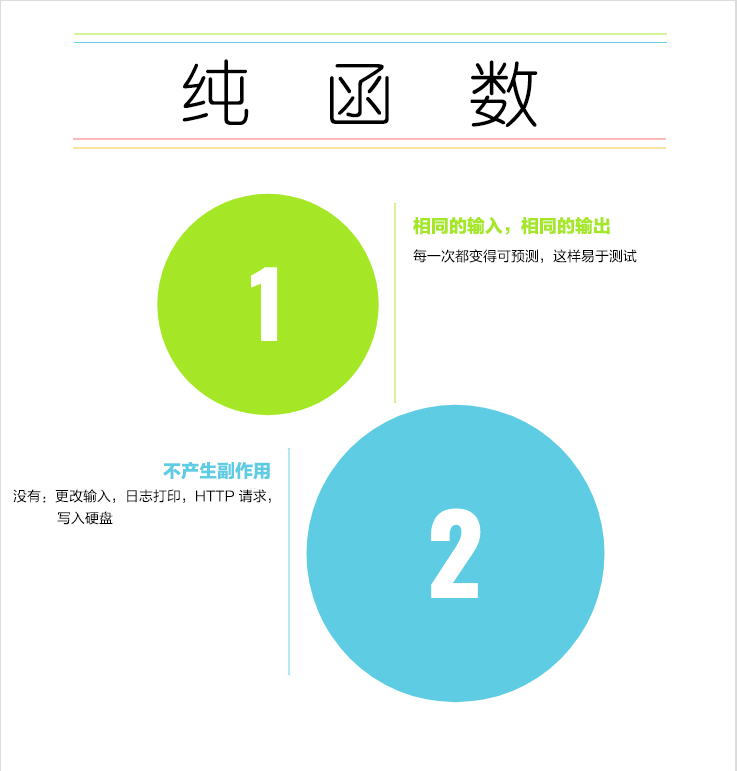

> - 原文地址：https://medium.freecodecamp.org/what-is-a-pure-function-in-javascript-acb887375dfe
> - 原文作者：[Yazeed Bzadough](https://medium.freecodecamp.org/@yazeedb)
> - Markdown 地址：https://github.com/wanghaiqiong/translation-articles-FE/blob/master/articles/【译】JavaScript中纯函数是什么.md

纯函数是程序函数式编程语言中原子构建块（最简单的可重用代码构建块）。简单和易测试性的特点使其备受推崇。

本文将提供一个快速检测列表，用于判断一个函数是否为纯函数。




# 检测列表
一个函数必须满足如下两点才能被称之为“纯的”：
1. 相同的输入 _总是_ 返回相同的输出
2. 不产生副作用

让我们逐一展开。

## 1、相同的输入 => 相同的输出

比较如下两版代码：
```js
const add = (x, y) => x + y;
add(2, 4); // 6
```
```js
let x = 2;
const add = (y) => {
  x += y;
};
add(4); // x === 6 (the first time)
```
### 纯函数 = 稳定的结果
不管你在何时何地调用第一个例子中的函数，得到的结果仅仅依赖于传入的参数。

如传入 `2` 和 `4`，得到结果 `6`。

输出不受其他任何因素影响。

### 非纯函数 = 不稳定的结果
第二个例子中的函数什么也不返回。它的工作依赖于 **共享状态**，递增了一个外部变量。

这样的话就是开发者的噩梦了。

**共享状态** 具有时间依赖性。不同的时间调用，会得到不一样的结果。第一次得到的结果是 `6`，第二次是 `10` 以此类推。

### 哪一版更加合理？
在某些特定条件下哪种方式更不容易产生 bug？

在那些受时间因素影响的多线程系统环境中哪种方式更容易成功？

显然是第一种。

## 2、不产生副作用


这一检测点本身也是一个检测列表。如下是一些副作用：
1. 可变数据
2. console.log
3. HTTP 请求（AJAX、fetch）
4. 更改文件系统
5. DOM 查询

基本上函数中执行的任何操作都与最终计算输入结果无关，仅仅依赖于传入的参数。

推荐大家看看 Uncle Bob Martin 对于系统状态问题的[讲解视频](https://www.youtube.com/embed/7Zlp9rKHGD4)。大约从 15min 处开始。

如下是产生了副作用的不纯函数。

### 还凑合

```js
const impureDouble = (x) => {
  console.log('doubling', x);
  return x * 2;
};
const result = impureDouble(4);
console.log({ result });
```

虽说 `console.log` 产生了副作用，但实际上它没什么不良影响。我们仍然能保证**相同的输入得到相同的输出**。

然而接下来这个就不一样了，可能会导致一些问题。

### “纯度污染”改变了对象
```js
const impureAssoc = (key, value, object) => {
  object[key] = value;
};
const person = {
  name: 'Bobo'
};
const result = impureAssoc('shoeSize', 400, person);
console.log({
  person,
  result
});
```
函数中的赋值语句，已经让变量 `person` 发生了不可逆的改变。

共享状态意味着 `impureAssoc` 的影响不那么明显。要理解它对系统产生的副作用，需跟踪它涉及到的每一个变量，了解这些变量的历史变化轨迹。

**<center>共享状态 = 时间相关性</center>**

把 `impureAssoc` 变纯很简单，我们只要返回一个包含所需属性的新对象即可。

### 使它变纯
```js
const pureAssoc = (key, value, object) => ({
  ...object,
  [key]: value
});
const person = {
  name: 'Bobo'
};
const result = pureAssoc('shoeSize', 400, person);
console.log({
  person,
  result
});
```

现在 `pureAssco` 返回一个明确可测试的结果，不再担心它会在其他地方偷偷地变了。

想将它变纯，你甚至可以如下这么做：

### 另一种变纯之法
```js
const pureAssoc = (key, value, object) => {
  const newObject = { ...object };
  newObject[key] = value;
  return newObject;
};
const person = {
  name: 'Bobo'
};
const result = pureAssoc('shoeSize', 400, person);
console.log({
  person,
  result
});
```

直接更改函数的输入是有些风险的，但改变输入的副本就没什么问题了。不管在哪里调用，我们都将得到一个稳定可测试的函数。

# 总结


- 不产生副作用，并且相同的输入总是返回相同的输出，那么这个函数是纯函数。
- 副作用包括但不限于：更改输入，HTTP 请求，磁盘写入，打印。
- 可以将函数输入拷贝一份用于更改，不要去动原来的数据。
- 扩展运算符语法（... 语法）是一种复制对象或者数据的简便方法。
